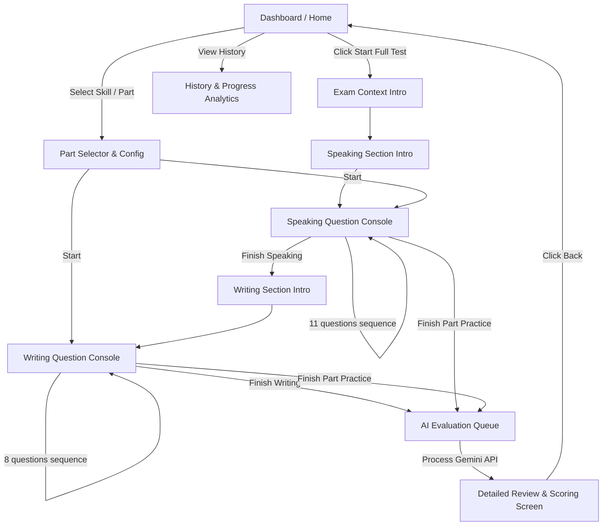

# Design System & User Experience (docs/DESIGN.md)

This document defines the Design System, visual identity guidelines, and UX philosophy applied across the **MASTER TOEIC** platform.

---

## 1. Design Philosophy

*   **Zen Testing Environment:** Once an exam is launched, all navigation headers, footers, and other potentially distracting elements disappear. The screen presents only the question stimulus, progress counters, input consoles, and countdown timers.
*   **Technical & Precision:** Employs crisp sharp-edged geometric card borders (1px or 2px thick), zero border radius (`0px` to `2px`), and monospace metrics to evoke a structured, standardized examination atmosphere.
*   **Anti-Cliché (No Bento or Aurora Mesh):** Rejects generic Bento grid arrangements, frosted glass blurs (glassmorphism), and aurora mesh blobs. Focuses on high-contrast backgrounds and typography layouts.

---

## 2. Color Palette & The Purple Ban

We enforce a strict **Purple Ban** (no purple or indigo) and **Fintech Blue Ban** (no deep teal or banking blue) to maintain originality. We use a technical palette designed for reading comfort and focal contrast:

### 2.1. Dark Theme (Default)
*   **Primary Background:** `#0F1115` (Deep Charcoal)
*   **Secondary Background / Cards:** `#161920` (Matte Tech Grey)
*   **Borders:** `#242B35` (Thin contrast borders)
*   **Primary Text:** `#E3E8EF` (Soft reading off-white)
*   **Secondary Text:** `#8896A6` (Muted support grey)
*   **Primary Accent (Timer / Recording):** `#FF5A1F` (Signal Orange - represents activity, alerts, time-critical actions)
*   **Secondary Accent (Success / Complete):** `#10B981` (Emerald Green)

### 2.2. Light Theme (Standard Exam Sheet)
*   **Primary Background:** `#FAF9F6` (Warm Paper)
*   **Secondary Background:** `#FFFFFF` (Pure White)
*   **Borders:** `#D1D5DB` (Light grey borders)
*   **Primary Text:** `#111827` (Dark slate)
*   **Secondary Text:** `#4B5563` (Muted slate)
*   **Primary Accent:** `#E64A19` (Deep signal orange)
*   **Secondary Accent:** `#059669` (Forest emerald)

---

## 3. Typography

Fonts loaded from Google Fonts:
*   **Headers & Action Buttons:** `Space Grotesk` (Geometric, sharp sans-serif, configured with compact tracking `letter-spacing: -0.025em`)
*   **Reading Passages & Prompts:** `Inter` or `Instrument Sans` (Clean sans-serif optimized for reading legibility)
*   **Timers & Counters:** `JetBrains Mono` or `Courier New` (Provides a mechanical, precise timing grid)

---

## 4. Layout Structures

### 4.1. Dashboard Layout - Asymmetric 70/30
*   Avoids symmetrical splits.
*   **Left Column (70%):** Available mock exams list rendered as sharp card blocks with state indicators (Not started, In progress, Completed with top score).
*   **Right Column (30%):** Mono-colored history charts displaying attempt scores progression.

### 4.2. Exam Consoles - Ultra Minimalist
*   **Speaking Console:**
    *   *Top:* Progress bar (Q1/11) and countdown timer styled in monospace. Under 10 seconds, the timer text turns orange-red and vibrates using a CSS micro-animation.
    *   *Center:* Question prompt or picture.
    *   *Bottom:* Ghi âm visualizer (waveform rendering signals using CSS keyframes when recording is active) and "Next" controls.
*   **Writing Console:**
    *   *Left:* Prompt stimulus / Reference emails.
    *   *Right:* Clean textarea editor with a subtle word count indicator anchored at the bottom-right corner.

---

## 5. Micro-Animations & Tactile States

*   **Timer Warning Pulse:** Below 5 seconds, the timer border pulses subtly corresponding to the second tick.
*   **Waveform visualizer:** Simple, GPU-accelerated CSS animation representing microphone capture activity.
*   **Bilingual Translation Slide:** Toggling English/Vietnamese labels slides and fades content slightly for a natural transition.
*   **Exam Navigation Slide:** Moving between questions slides content horizontally, simulating turning pages on an exam sheet.

---

## 6. Main Navigation Schema (Mermaid)

