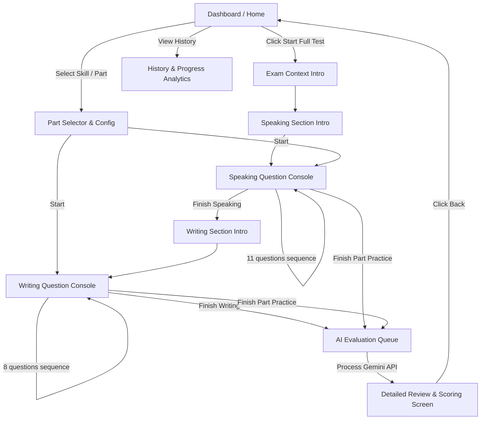

# Design System & User Experience Document (DESIGN.md)

Tài liệu này định nghĩa hệ thống thiết kế (Design System), triết lý UX và giao diện trực quan cho ứng dụng **MasterToeic S&W**. 

---

## 1. Triết lý Thiết kế (Design Philosophy)
* **Zen Testing Environment (Giao diện tập trung tối đa):** Khi bước vào chế độ làm bài, toàn bộ thanh điều hướng, footer và các yếu tố gây xao nhãng khác sẽ biến mất. Màn hình chỉ hiển thị đề bài, khu vực trả lời, thanh tiến độ và bộ đếm thời gian.
* **Technical & Precision (Chuyên nghiệp & Chính xác):** Sử dụng các đường nét sắc cạnh, viền mảnh (1px/2px), bo góc tối thiểu (0px - 2px) để tạo cảm giác nghiêm túc, giống như một bài thi tiêu chuẩn quốc tế thực sự nhưng ở phiên bản cao cấp và hiện đại hơn.
* **Anti-Cliché (Không rập khuôn):** Loại bỏ hoàn toàn bento grid đại trà, không sử dụng các hiệu ứng làm mờ kính (glassmorphism) hay các vệt màu gradient loang lổ (mesh gradient). Màu sắc có độ tương phản cao, rõ ràng.

---

## 2. Hệ thống Màu sắc & Tránh Cliché (Color Palette)
Chúng tôi tuân thủ nghiêm ngặt **Quy tắc cấm màu Tím (Purple Ban)** và cấm màu Xanh Fintech (Fintech Blue). Thay vào đó, chúng tôi sử dụng bảng màu mang tính kỹ thuật và tập trung:

### 2.1. Dark Theme (Mặc định)
* **Background chính:** `#0F1115` (Chì đậm / Charcoal)
* **Background phụ / Card:** `#161920` (Đen xám kỹ thuật)
* **Border:** `#242B35` (Viền mảnh có độ tương phản thấp)
* **Text chính:** `#E3E8EF` (Off-white dễ đọc)
* **Text phụ:** `#8896A6` (Màu xám hỗ trợ)
* **Accent chính (Timer / Đang hoạt động):** `#FF5A1F` (Signal Orange - Màu cam cảnh báo, mang tính chất thời gian, hành động)
* **Accent phụ (Success / Đạt điểm):** `#10B981` (Emerald Green - Xanh ngọc lục bảo)

### 2.2. Light Theme (Môi trường giấy thi)
* **Background chính:** `#FAF9F6` (Màu giấy ấm / Warm Paper)
* **Background phụ:** `#FFFFFF` (Trắng tinh khiết)
* **Border:** `#D1D5DB` (Viền xám nhạt)
* **Text chính:** `#111827` (Charcoal đậm)
* **Text phụ:** `#4B5563` (Màu xám đậm)
* **Accent chính:** `#E64A19` (Cam đậm)
* **Accent phụ:** `#059669` (Xanh lục đậm)

---

## 3. Typography (Hệ thống chữ)
Sử dụng các font từ Google Fonts mang tính chuyên nghiệp cao:
* **Headers & UI Accents:** `Space Grotesk` (Hình học, hiện đại, sắc sảo)
* **Reading Passages & Questions:** `Inter` hoặc `Instrument Sans` (Tối ưu hóa khả năng đọc trên màn hình)
* **Monospace (Timer & Word Count):** `JetBrains Mono` hoặc `Courier New` (Tạo cảm giác đo lường cơ học chính xác)

---

## 4. Thiết kế Layout (Layout Structures)

### 4.1. Trang chủ (Dashboard) - Trực quan & Bất đối xứng
* Tránh layout chia đôi 50/50 truyền thống. 
* Sử dụng bố cục **Asymmetric 70/30 (Bất đối xứng)**:
  * Bên trái (70%): Danh sách các đề thi được thiết kế dạng thẻ sắc cạnh với trạng thái làm bài (Chưa làm, Đang làm dở, Đã hoàn thành kèm điểm số cao nhất).
  * Bên phải (30%): Biểu đồ cột đơn sắc thể hiện lịch sử điểm số và tiến trình ôn luyện gần đây của học viên.

### 4.2. Giao diện Phòng thi (Exam Console) - Tối giản tối đa
* **Bố cục màn hình thi Speaking:**
  * Khu vực trung tâm: Hiển thị câu hỏi/đoạn văn bản/hình ảnh mô tả.
  * Phía trên: Thanh tiến độ câu hỏi (Q1/11) và đồng hồ đếm ngược với kích thước lớn sử dụng font Monospace. Khi thời gian dưới 10 giây, đồng hồ sẽ đổi sang màu đỏ cam và có hiệu ứng rung nhẹ (micro-animation).
  * Phía dưới: Trình ghi âm (sóng âm thanh mô phỏng chạy bằng CSS khi đang thu âm) và nút điều hướng "Next / Skip".
* **Bố cục màn hình thi Writing:**
  * Bố cục chia dọc bất đối xứng: 
    * Bên trái: Đề bài/Hình ảnh gợi ý/Đoạn email gốc.
    * Bên phải: Khung soạn thảo văn bản kèm bộ đếm từ trực quan chạy ngầm ở góc dưới.

---

## 5. Micro-Animations & Phản hồi vật lý (Visual Effects)
* **Timer Pulse:** Khi đồng hồ đếm ngược xuống dưới 5 giây, vòng tròn border quanh số giây sẽ nháy nhẹ theo nhịp đếm.
* **Waveform Audio:** Khi người dùng nói, một bộ sóng âm (Audio Waveform) dạng đơn giản tạo bằng CSS/JS sẽ nhấp nháy liên tục thể hiện hệ thống đang nhận tín hiệu micro thành công.
* **Bilingual Switch Transition:** Khi bấm nút chuyển đổi ngôn ngữ (EN / VI), các nhãn UI sẽ có hiệu ứng trượt nhẹ (slide & fade-in) tạo cảm giác mượt mà chứ không thay đổi đột ngột.
* **Transition khi chuyển câu:** Hiệu ứng dịch chuyển ngang (Slide left-to-right) mượt mà mô phỏng việc lật trang giấy thi.

---

## 6. Sơ đồ các luồng màn hình chính (Mermaid Diagram)

